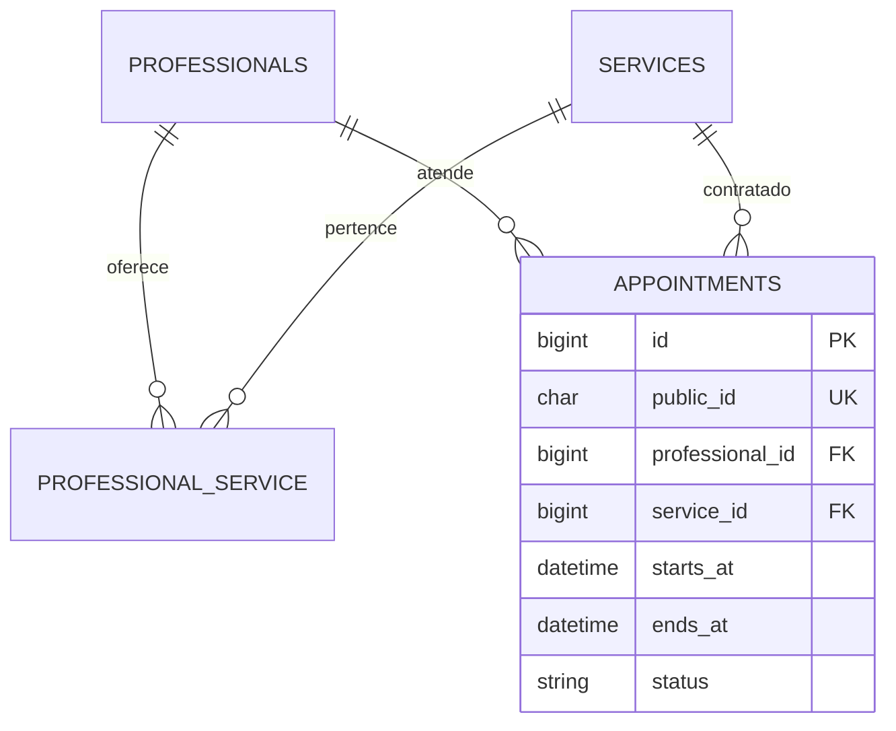
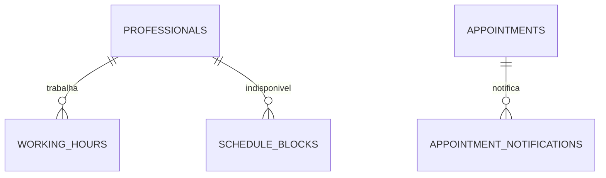

# Barbearia — telas e modelo de dados do MVP

Versão 0.2 · 5 de outubro de 2026 · Etapa 1: planejamento.

Stack definida: React com JavaScript, Laravel com PHP, MySQL, Docker e testes. Este documento define a proposta inicial de produto e dados; não representa funcionalidades implementadas ou decisões adicionais já aprovadas pelo usuário.

## 1. Limites e decisões propostas

- Uma única barbearia, vários profissionais e um administrador. Sem cadastro público de usuário e sem login de profissional nesta versão.
- Uma reserva atende um cliente, com um profissional e um serviço. “Corte + barba” pode ser um serviço próprio.
- O cliente escolhe o profissional. A opção “qualquer profissional” fica para uma evolução.
- No público, nome, e-mail e telefone são obrigatórios. No administrador, nome é obrigatório; e-mail e telefone são opcionais. Não existe conta do cliente. Sem e-mail, não criar notificação nem oferecer envio/reenvio.
- Reserva confirmada imediatamente após a gravação. O e-mail comunica a confirmação; não é uma etapa de aprovação.
- Cancelamento pelo cliente permitido até o limite de antecedência configurado em `cancel_min_notice_minutes` (padrão 0) e sempre antes do início. O administrador pode cancelar uma reserva confirmada mesmo após esse limite, com registro de autoria.
- Agenda pública com horizonte de 30 dias e início mínimo 60 minutos no futuro; parâmetros configuráveis pelo administrador. O administrador ignora a antecedência mínima e pode usar “Atender agora”, cujo início é calculado pelo servidor no momento da gravação; não permite horário retroativo arbitrário. Limite de horizonte permanece para reservas futuras do admin.
- Horários públicos sugeridos a cada 15 minutos; “Atender agora” pode iniciar fora dessa grade, com fim calculado pela duração do serviço. A duração vem do serviço; a reserva precisa caber integralmente em um período de expediente.
- Limite público de 3 reservas futuras confirmadas por e-mail OU telefone normalizado, configurável por `max_active_per_contact`. Verificar cada contato separadamente, contando também reservas do admin com o mesmo contato. Admin pode ultrapassar o teto; manter rate limit. Normalizar e-mail por trim/lowercase, sem remover pontos ou aliases; normalizar telefone para E.164. O limite usa contatos exatos normalizados, sem inferir identidade. Contatos falsos diferentes ainda contornam o limite: ele reduz abuso, não verifica identidade.
- Sem pagamento, WhatsApp, recorrência, lista de espera, múltiplas unidades ou remarcação automática.
- Remarcação no MVP: cancelar e criar uma nova reserva. Não oferecer uma ação que possa perder a reserva original silenciosamente.

## 2. Telas públicas

O agendamento usa uma página com quatro passos, preservando escolhas ao voltar. No celular, os passos e o resumo ficam empilhados; no desktop, o resumo aparece ao lado.

| Tela / rota | Composição | Ações e estados |
| --- | --- | --- |
| Início — `/` | Nome da barbearia, apresentação curta, endereço, contato e serviços com preço e duração | “Agendar horário”; serviços inativos não aparecem |
| Agendamento — `/agendar` | Passo 1: cards de serviço. Passo 2: cards de profissionais habilitados. Passo 3: data e horários livres. Passo 4: dados do cliente e resumo | Avançar, voltar e confirmar; carregamento, erro com nova tentativa, nenhuma disponibilidade e validação de campos |
| Resultado — mesma jornada de `/agendar` | Confirmação, serviço, profissional, data, horário, preço, endereço e aviso sobre e-mail | Voltar ao início; evitar rota pública que exponha dados pessoais por ID sequencial |
| Cancelamento — `/cancelar/{public_id}?expires=...&signature=...` | Resumo mínimo da reserva e pergunta de confirmação | Abrir o link apenas consulta. Botão “Confirmar cancelamento” envia POST; mostrar cancelado, já cancelado, link inválido/expirado ou atendimento já iniciado |

### Composição do agendamento

1. Cabeçalho compacto: logotipo/nome, endereço e contato.
2. Indicador: Serviço → Profissional → Horário → Seus dados.
3. Área principal: opções do passo atual, com seleção visível e acesso pelo teclado.
4. Resumo: serviço, duração, profissional, data, horário e preço. Informações ainda não escolhidas aparecem como “A escolher”.
5. Ações: “Voltar” e “Continuar”; no último passo, “Confirmar agendamento”.

O preço vem da API. Não existe cálculo confiável de preço ou duração baseado em valores enviados pelo navegador.

### Comportamentos importantes

- Ao mudar serviço ou profissional, limpar escolhas de data/horário que deixaram de ser válidas.
- Consultar disponibilidade novamente ao escolher a data. A lista é informativa: a confirmação precisa revalidar no servidor.
- Se outro cliente ocupar o horário, informar “Esse horário acabou de ser reservado. Escolha outro.”, atualizar a lista e preservar os dados do cliente.
- Desabilitar o botão durante o envio; usar chave de idempotência para repetição causada por duplo clique, timeout ou nova tentativa.
- Se a reserva foi salva e o e-mail estiver atrasado, manter a confirmação na tela. Não induzir uma segunda reserva.
- A confirmação visual é mantida na jornada atual; recuperar a reserva em outro dispositivo depende do link recebido por e-mail.
- Não guardar nome, telefone ou e-mail em URL ou logs de navegação. No link de cancelamento, aplicar `Referrer-Policy: no-referrer`, evitar scripts de terceiros e redigir a assinatura nos logs.

## 3. Telas do administrador

Login privado; cadastro do primeiro administrador por seed/comando, sem registro público.

| Tela / rota | Conteúdo e ações |
| --- | --- |
| Login — `/admin/login` | E-mail, senha, erros de autenticação e encerramento seguro de sessão |
| Agenda — `/admin/agenda` | Tela inicial após login. Data, navegação anterior/hoje/próxima, filtro de profissional e status; lista cronológica no celular, grade diária no desktop; ação “Novo agendamento” |
| Detalhes da reserva — drawer/modal da agenda | Dados do cliente, serviço e preço da reserva, início/fim, profissional e status; cancelar, concluir, marcar ausência e reenviar confirmação quando aplicável |
| Novo agendamento — modal ou página da agenda | Nome obrigatório, contatos opcionais, “Agendar” ou “Atender agora”; ignora antecedência pública e teto por contato, mas mantém expediente, vínculo ativo, duração e conflitos |
| Serviços — `/admin/servicos` | Lista, criar/editar nome, descrição, duração em minutos, preço e ativação; desativar sem apagar histórico |
| Profissionais — `/admin/profissionais` | Lista, criar/editar nome público, descrição opcional, serviços oferecidos e ativação |
| Expediente — `/admin/expediente` | Seleção de profissional, dias da semana e períodos; copiar para outros dias; vários períodos no mesmo dia, por exemplo 09h–12h e 13h–18h |
| Bloqueios — `/admin/bloqueios` | Profissional, intervalo de datas/horas e motivo interno; listar, criar e remover; um bloqueio não cancela reservas existentes |
| Configurações — `/admin/configuracoes` | Nome da barbearia, endereço, contato, fuso horário, antecedência pública, horizonte, antecedência de cancelamento e teto por contato |

Não criar dashboard de indicadores separado no MVP. A agenda resolve a operação diária.

### Estados da agenda

- `confirmed`: ocupa horário; pode ser cancelado pelo cliente antes do limite configurado, pelo admin enquanto confirmado, concluído após o fim ou marcado como ausência após o início.
- `cancelled`: libera horário; estado final.
- `completed`: preserva o atendimento realizado; estado final, permitido após o fim.
- `no_show`: registra ausência; estado final, permitido após o início; não permite nova reserva retroativa.

Reservas públicas são futuras; o admin também pode registrar atendimento imediato pelo modo “Atender agora”. Reservas concluídas e ausências preservam seu intervalo no histórico. A interface deve distinguir estados por texto, não apenas cor.

## 4. Modelo de dados

Convenções: IDs numéricos internos, timestamps de auditoria, chaves estrangeiras e InnoDB. Instantes são persistidos em UTC; expediente semanal usa hora local da barbearia. Valores monetários em `DECIMAL(10,2)`, nunca float. Campos `is_active` controlam cadastros sem excluir referências históricas.

| Tabela | Campos de negócio | Finalidade e restrições |
| --- | --- | --- |
| `users` | `id`, `name`, `email`, `password`, timestamps | Administradores apenas. E-mail único e senha com hash. Campos auxiliares de autenticação definidos na fundação técnica |
| `business_settings` | `id`, `name`, `address`, `phone`, `timezone`, `min_notice_minutes`, `booking_horizon_days`, `cancel_min_notice_minutes`, `max_active_per_contact`, timestamps | Registro único. Inicial: `America/Sao_Paulo`, 60 minutos, 30 dias, cancelamento 0 minutos e teto 3. Passo de horários fixo em 15 minutos no MVP |
| `services` | `id`, `name`, `description` nullable, `duration_minutes`, `price`, `is_active`, timestamps | Duração inteira positiva e preço não negativo |
| `professionals` | `id`, `name`, `description` nullable, `is_active`, timestamps | Profissional não possui login; desativar impede novas reservas, sem cancelar as existentes |
| `professional_service` | `professional_id`, `service_id` | Relação N:N; par único. Preço/duração são os do serviço, sem variação por profissional |
| `working_hours` | `id`, `professional_id`, `weekday`, `start_time`, `end_time`, timestamps | 0 = domingo a 6 = sábado; início menor que fim; períodos do mesmo dia não se sobrepõem; sem expediente atravessando meia-noite no MVP |
| `schedule_blocks` | `id`, `professional_id`, `starts_at`, `ends_at`, `reason` nullable, timestamps | Intervalo UTC; início menor que fim. Motivo acessível apenas ao administrador. Para fechar a barbearia inteira, criar bloqueios para todos os profissionais numa operação atômica |
| `appointments` | `id`, `public_id`, `professional_id`, `service_id`, `customer_name`, `customer_email` nullable, `customer_phone` nullable, `starts_at`, `ends_at`, `status`, `source`, `service_name_snapshot`, `duration_minutes_snapshot`, `price_snapshot`, `cancelled_at` nullable, `cancelled_by` nullable, `idempotency_key`, `request_fingerprint`, timestamps | `source`: `public` ou `admin`. `cancelled_by`: `customer` ou `admin`. `public_id` (ULID) e chave de idempotência únicos. E-mail canônico (trim/lowercase) e telefone E.164; campos nullable só no fluxo admin. Status inicial `confirmed`. Snapshots preservam o que foi contratado |
| `appointment_notifications` | `id`, `appointment_id`, `kind`, `status`, `attempts`, `sent_at` nullable, `last_error_code` nullable, timestamps | Notificação transacional de confirmação. `kind=confirmation`; par `(appointment_id, kind)` único; status `pending`, `sent`, `failed` ou `skipped`. Gerar URL assinada no envio/reenvio; sem payload cifrado. Sem dados sensíveis no erro |

Não criar tabela de clientes no MVP: cada reserva guarda o contato daquele atendimento. Isso evita transformar “sem conta” em um cadastro implícito com deduplicação ainda não definida. `jobs` e `failed_jobs`, se usadas com fila de banco, são infraestrutura do Laravel, não entidades do produto.

### Relacionamentos

| Origem | Relação | Destino |
| --- | --- | --- |
| Profissional | N:N | Serviço, por `professional_service` |
| Profissional | 1:N | Períodos de expediente |
| Profissional | 1:N | Bloqueios |
| Profissional | 1:N | Agendamentos |
| Serviço | 1:N | Agendamentos |
| Agendamento | 1:N | Notificações; no MVP, uma confirmação lógica |

### Índices e integridade

- `users.email`: único.
- `professional_service(professional_id, service_id)`: único.
- `working_hours(professional_id, weekday, start_time)`: índice.
- `schedule_blocks(professional_id, starts_at, ends_at)`: índice para consulta de intervalos.
- `appointments(professional_id, starts_at)`: índice para agenda e conflitos; incluir análise do plano de execução quando existir volume real.
- `appointments.public_id`: único; `appointments.idempotency_key`: único.
- `appointments(customer_email, status, starts_at)` e `(customer_phone, status, starts_at)`: índices para teto por contato.
- `appointment_notifications(appointment_id, kind)`: único.
- FKs de agendamentos com exclusão restrita para serviços/profissionais. Não apagar reservas pela interface.
- Validar intervalos, preço e duração no servidor; adicionar checks de banco compatíveis com a versão selecionada na etapa 2.

## 5. Disponibilidade e prevenção de reservas simultâneas

Um candidato é válido quando: serviço/profissional ativos e vinculados; início dentro do horizonte e, no público, da antecedência mínima; no admin, permitir início imediato calculado pelo servidor; intervalo completo contido num período de expediente; nenhuma interseção com bloqueios ou reservas não canceladas.

Exemplo: serviço de 45 minutos, expediente 09h–12h e 13h–18h, reserva 10h–10h45. 09h15–10h é permitido; 09h30–10h15 conflita; 11h30–12h15 atravessa o intervalo de almoço e é recusado.

Tratar intervalos como `[início, fim)`: um atendimento que termina às 10h permite outro às 10h. Há conflito quando:

```text
existente.starts_at < novo.ends_at
AND existente.ends_at > novo.starts_at
```

Um índice único em `(professional_id, starts_at)` não evita sobreposição entre durações diferentes. A checagem e inserção precisam estar na mesma transação:

1. Validar formato e chave de idempotência.
2. Obter primeiro o lock do registro único de `business_settings`, depois o lock do profissional. Todos os caminhos que alteram a agenda ou seus cadastros seguem essa ordem; em operações com vários profissionais, travar em ordem de ID.
3. Repetição idempotente com o mesmo fingerprint retorna a reserva existente antes de verificar o teto. Chave reaproveitada com outro payload é recusada.
4. Ler dados atuais, conferir expediente, duração, vínculo, bloqueios e conflitos. Na criação pública, contar reservas futuras confirmadas separadamente por e-mail e telefone; recusar se qualquer contagem já atingiu o teto.
5. Criar reserva e, apenas se houver e-mail e o início ainda for futuro, notificação `pending` na mesma transação. Fazer commit.
6. Enviar fora da transação. Falha de e-mail não desfaz a reserva; varredura periódica recupera notificações pendentes.

O lock de `business_settings` é uma escolha simples para este MVP: serializa alterações curtas de agenda de toda a barbearia e garante o teto mesmo para requisições em profissionais diferentes, sem uma tabela extra de contatos. Isso reduz concorrência de escrita, mas é aceitável como proposta para uma barbearia pequena. Não manter a transação aberta durante envio de e-mail. Se houver necessidade real de escala, substituir esse lock global por locks por contato e revisar o protocolo com testes.

O lock por profissional permanece explícito para reservas, cancelamentos, bloqueios e expediente. Fechamento geral e alterações em serviço compartilhado podem afetar vários profissionais; não é correto afirmar que apenas o fechamento exige essa coordenação. Ordem de ID e retry limitado de deadlock bastam como contrato inicial; os detalhes serão definidos com os testes da implementação.

Base técnica consultada: [MySQL — Locking Reads](https://dev.mysql.com/doc/refman/8.0/en/innodb-locking-reads.html) e [Laravel — Query Builder / Pessimistic Locking](https://laravel.com/docs/9.x/queries#pessimistic-locking). A versão concreta da stack será definida na etapa 2; o link do Laravel documenta o mecanismo, não fixa essa versão para o projeto.

## 6. Cancelamento e e-mail

- `public_id` é um ULID público único. Não é um segredo nem autoriza consulta/cancelamento sozinho.
- Gerar URL com `temporarySignedRoute`, expirando em `starts_at`; verificar assinatura e expiração em GET e POST. Não persistir hash de token, expiração de token ou payload cifrado. A assinatura usa a chave da aplicação Laravel, que continua sendo um segredo necessário.
- Reenvio gera uma URL assinada novamente; não revoga URLs anteriores válidas. A revogação funcional é a checagem de status e início. Remarcação continua sendo uma nova reserva; não reabrir reserva cancelada.
- Aplicar também `now < starts_at - cancel_min_notice_minutes` no POST. Com padrão 0, cancelamento permitido só antes do início. Mudança da configuração vale para cancelamentos futuros, inclusive links já emitidos. A expiração da assinatura continua em `starts_at`, permitindo explicar na tela por que o prazo para cancelar acabou.
- GET mostra resumo mínimo sem contatos pessoais; POST explícito cancela. Scanners de e-mail não cancelam por abrir o link. Repetição válida mostra “já cancelado”; assinatura inválida/expirada não revela a reserva.
- Para evitar divergência de host/path entre React e API, o link assinado aponta inicialmente para a rota Laravel `/cancelar/{public_id}`. GET serve uma página mínima e POST usa o mesmo path/query assinados e proteção CSRF. Não reescrever o link para o host do React. As demais telas permanecem em React.
- Cancelamento libera horário, registra data/autor e não apaga histórico. O admin autenticado usa rota própria e pode cancelar enquanto `confirmed`, sem depender de assinatura pública ou antecedência mínima.
- E-mail contém serviço, profissional, data/hora no fuso da barbearia, endereço, preço e link de cancelamento.
- Não criar notificação sem e-mail. No modo “Atender agora”, não enviar confirmação com link já expirado. Antes do envio/reenvio, conferir reserva confirmada e futura; caso contrário, marcar `skipped`. Reutilizar a notificação lógica; entrega externa pode se repetir após timeout do provedor.
- Dados de cliente são privados; aplicar rate limits e evitar exposição de assinatura, e-mail e telefone em logs.

Referência: [Laravel — Signed URLs](https://laravel.com/framework/docs/10.x/urls#signed-urls).

## 7. Alterações de cadastro sem quebrar reservas

- Editar preço, nome ou duração de serviço afeta apenas novas reservas. A reserva existente mantém seus snapshots e fim calculado na criação.
- Desativar serviço/profissional ou remover vínculo impede novas reservas; manter os agendamentos existentes na agenda e informar ao administrador que precisam de tratamento manual, se necessário.
- Criar bloqueio em cima de reserva confirmada é recusado; exibir os conflitos. Não cancelar silenciosamente.
- Reduzir expediente de modo que exclua uma reserva futura confirmada é recusado; permitir correção após cancelamento explícito dessa reserva.
- Fuso horário permanece fixo após a primeira reserva neste MVP para evitar reinterpretar o expediente e os agendamentos existentes.

## 8. Testes que orientarão a implementação

| Área | Evidência esperada |
| --- | --- |
| Disponibilidade | Durações diferentes, almoço, limite de expediente, dia fechado, bloqueio parcial/integral, antecedência e horizonte |
| Concorrência | Em MySQL real, duas conexões/requisições simultâneas para intervalos sobrepostos: exatamente uma reserva e outra resposta de conflito; profissionais diferentes permitidos |
| Corrida com bloqueio | Reserva versus criação de bloqueio: apenas um pode ocupar o intervalo; o outro recebe conflito |
| Idempotência | Repetir mesmo payload/chave retorna a mesma reserva; reutilizar chave com outro payload é recusado |
| Cancelamento | GET não altera estado; POST válido cancela; repetição é inofensiva; assinatura adulterada/expirada, ULID sem assinatura e prazo de cancelamento vencido são recusados |
| Notificação | Falha de envio mantém reserva e permite retry; rollback não cria confirmação; pendência é recuperada após falha no despacho |
| Teto por contato | E-mail normalizado e telefone E.164; contatos tratados separadamente; com duas reservas existentes e duas criações simultâneas em profissionais distintos, apenas uma terceira é aceita; replay idempotente continua funcionando |
| Atendimento imediato | Admin sem e-mail/telefone pode iniciar agora dentro do expediente; público mantém contatos obrigatórios e antecedência; ausência de notificação no atendimento imediato |
| Histórico | Alterar serviço não modifica valor/duração da reserva; desativação não apaga dados |
| Autorização | Público não acessa clientes, agenda interna ou CRUD; administrador autenticado pode operar |
| React | Voltar preserva dados; mudar serviço/profissional invalida horário; conflito atualiza opções e mantém contato; mobile e teclado funcionam |
| E2E | Cadastrar serviço/profissional/expediente → reservar → confirmar → cancelar → horário voltar a aparecer |

Backend: testes de unidade para cálculos e testes de integração para banco/API; concorrência obrigatoriamente com MySQL, não SQLite. Frontend: testes dos comportamentos relevantes; E2E com uma ferramenta escolhida na fundação técnica.

## 9. Ligação com as sete etapas

| Etapa | Entrega e condição de avanço |
| --- | --- |
| 1. Planejamento | Este mapa, regras e modelo; próximo passo: wireframes de horário público, agenda admin e cancelamento; ER e contrato inicial da API |
| 2. Fundação técnica | Repositório, Docker, autenticação administrativa, migrations, seed, fila/e-mail local e CI com MySQL real; smoke tests de banco desde esta etapa e testes de concorrência entrando assim que implementados na etapa 4 |
| 3. Cadastros | Serviços, profissionais, vínculos e expediente funcionando com validação |
| 4. Disponibilidade | Motor de horários, bloqueios e testes de limites/concorrência |
| 5. Agendamento público | Jornada completa, idempotência, confirmação por e-mail e cancelamento por link |
| 6. Operação da agenda | Agenda diária, reserva pelo admin, detalhes e transições de status |
| 7. Publicação | Ambiente público, dados fictícios, documentação de execução, validação do CI já existente e demonstração dos cenários principais |

O resultado de portfólio deve demonstrar regras de negócio e evidências dos testes, além das telas. Dados publicados e contas de demonstração serão fictícios.


## 10. Diagrama ER

Separado em duas vistas para facilitar a leitura. IDs de relação são internos; `public_id` identifica a reserva externamente, sem substituir assinatura ou autenticação.





`users` e `business_settings` são independentes, sem FKs neste MVP. O diagrama é conceitual; tipos e tamanhos exatos serão definidos nas migrations.

## 11. Contrato inicial da API

API versionada sob `/api/v1`. Instantes em ISO 8601 com offset explícito; a API retorna UTC. Datas do calendário são interpretadas no fuso da barbearia. Horário final, preço, duração, status e origem são determinados pelo servidor.

| Método / endpoint | Entrada | Resposta e regras |
| --- | --- | --- |
| `GET /public/availability` | Query `service_id`, `professional_id`, `date` (`YYYY-MM-DD`) | `200`: `timezone`, `date`, `slots` com `starts_at` e `ends_at`. Sem horários: `slots: []`. Não retorna clientes ou motivos internos de bloqueio. `422` para formato/incompatibilidade inválidos |
| `POST /public/appointments` | Header `Idempotency-Key`; corpo abaixo | `201`: reserva criada, `public_id`, resumo e `notification_status`. Replay idempotente: `200`, mesmo resultado de negócio, sem nova reserva ou e-mail |
| `POST /admin/appointments` | Sessão admin, mesmo header; `mode=scheduled` com `starts_at` ou `mode=now` sem `starts_at`; nome obrigatório e contatos opcionais | `201`, sem antecedência/teto públicos; horário de `now` calculado pelo servidor sob transação. Mesmas regras de expediente/conflito |
| `GET /cancelar/{public_id}` | Query assinada `expires` e `signature` | Fora do prefixo API, página Laravel de confirmação. Sem mutação. `403` para assinatura inválida/expirada |
| `POST /cancelar/{public_id}` | Mesmo path/query assinados + CSRF | Cancela ou informa “já cancelado”; recusa prazo/status inválido. Redireciona para GET assinado após sucesso para evitar reenvio de formulário |

Exemplo de criação pública:

```json
{
  "service_id": 1,
  "professional_id": 2,
  "starts_at": "2026-10-10T10:00:00-03:00",
  "customer_name": "Cliente Demonstração",
  "customer_email": "cliente@example.com",
  "customer_phone": "+5511999999999"
}
```

Erros JSON dos endpoints API: `{ "error": { "code": "...", "message": "...", "fields": {} } }`. `fields` é usado apenas para validação. Não revelar reservas existentes ou dados de outro cliente nos erros.

| HTTP | Código de negócio | Comportamento da interface |
| --- | --- | --- |
| 409 | `SLOT_UNAVAILABLE` | Atualizar horários e preservar dados do cliente |
| 409 | `CONTACT_LIMIT_REACHED` | Explicar que há limite de reservas futuras e oferecer contato com a barbearia; não confirmar se um contato específico existe |
| 409 | `IDEMPOTENCY_KEY_REUSED` | Não repetir com payload alterado; gerar nova chave para uma nova intenção de reserva |
| 422 | `VALIDATION_ERROR` | Mostrar erro junto ao campo |
| 429 | `RATE_LIMITED` | Orientar aguardar; respeitar `Retry-After` |
| 401 | `UNAUTHENTICATED` | Encaminhar admin ao login |

Uma chave representa uma intenção de reserva. Reutilizar em retry de rede com o mesmo payload; gerar outra ao alterar serviço, profissional ou horário. Endpoints públicos e admin compartilham unicidade de chave e vinculam o fingerprint ao contexto público/admin para impedir replay cruzado. Não aceitar preço/fim/origem do navegador. Um ID público sozinho não permite consultar dados da reserva.

## 12. Wireframes prioritários — composição para desenho

| Tela | Desktop | Celular | Estados a desenhar |
| --- | --- | --- | --- |
| Horário público (passo 3) | Calendário e grade de horários à esquerda; resumo à direita; voltar/continuar abaixo | Data, horários, resumo compacto e ações empilhados | Carregando, horários livres, dia vazio, erro de rede com retry e conflito após confirmação |
| Agenda admin | Cabeçalho com data/filtros/novo; coluna de horários e colunas por profissional; bloqueios marcados | Data e filtro acima de lista cronológica; cards com profissional, cliente, serviço e status | Dia vazio, reserva, bloqueio, detalhe aberto e ação “Atender agora” |
| Cancelamento | Card central com serviço, profissional, data/hora e ação explícita | Mesmo card ajustado à largura | Pode cancelar, prazo encerrado, já cancelado, sucesso e link inválido/expirado |

Esta seção define a composição; ainda não são protótipos visuais nem telas implementadas.

## 13. Contratos implementados — Cadastros administrativos

Esta seção registra o que foi efetivamente implementado nas etapas de fundação técnica, autenticação administrativa e cadastros, em complemento às seções 4 e 11 (que continuam descrevendo a proposta original). Detalhes de uso, exemplos e decisões de implementação ficam em `docs/desenvolvimento.md`; aqui fica só o contrato.

**Já implementado:**

- Autenticação administrativa por sessão/cookie (Sanctum SPA) — `POST /api/v1/admin/login`, `GET /api/v1/admin/me`, `POST /api/v1/admin/logout`, `GET /sanctum/csrf-cookie`. Ver seção "Autenticação administrativa" em `docs/desenvolvimento.md`.
- `business_settings`: singleton criado via `BusinessSettingsSeeder` com os valores desta seção 4 (`America/Sao_Paulo`, 60, 30, 0, 3). Sem tela nem endpoint de edição ainda — só leitura interna (lock) pelas rotas abaixo.
- Serviços — `GET/POST /api/v1/admin/services`, `PATCH /api/v1/admin/services/{id}`.
- Profissionais — `GET/POST /api/v1/admin/professionals`, `PATCH /api/v1/admin/professionals/{id}`, incluindo vínculo N:N com serviços (`professional_service`).
- `business_settings`: leitura via `GET /api/v1/admin/business-settings` (ainda sem edição — ver abaixo).
- Expediente semanal — `GET/PUT /api/v1/admin/professionals/{id}/working-hours` (`working_hours`).
- Bloqueios — `GET/POST /api/v1/admin/schedule-blocks`, `DELETE /api/v1/admin/schedule-blocks/{id}`, `DELETE /api/v1/admin/schedule-blocks/groups/{group_id}` (`schedule_blocks`, com `group_id` para fechamentos da barbearia — ver seção 14).

**Ainda não implementado (planejado para etapas futuras):** disponibilidade, catálogo público, agendamentos (`appointments`), notificações, cancelamento por link, e tela/endpoint de **edição** de `business_settings` (a leitura já existe).

### Serviços — `/api/v1/admin/services`

Todas as rotas exigem sessão administrativa (`401 UNAUTHENTICATED` sem sessão válida) e, nas mutações, CSRF (ver `docs/desenvolvimento.md`).

| Método | Rota | Corpo | Resposta |
| --- | --- | --- | --- |
| `GET` | `/services` | — | `200` `{"data": [...]}`, ativos e inativos, ordenados por `id` |
| `POST` | `/services` | `name`, `description?`, `duration_minutes`, `price`, `is_active?` | `201` `{"data": {...}}` |
| `PATCH` | `/services/{id}` | qualquer subconjunto dos campos acima | `200` `{"data": {...}}`; campo omitido mantém o valor atual |

Exemplo de objeto de serviço:

```json
{
  "id": 1,
  "name": "Corte masculino",
  "description": null,
  "duration_minutes": 30,
  "price": "45.00",
  "is_active": true
}
```

`price` é sempre uma **string decimal** (nunca número/float), para preservar precisão de centavos — `DECIMAL(10,2)` no banco, validado no servidor como `numeric`, `min:0`, `max:99999999.99` e no formato `\d{1,8}(\.\d{1,2})?`. `duration_minutes` é inteiro, `min:1`, `max:1440`. Ativação/desativação é só mais um campo do `PATCH` (`is_active`); não existe exclusão definitiva.

Erros: `422 VALIDATION_ERROR` (campos inválidos, com `fields`), `404 NOT_FOUND` (id inexistente no `PATCH`) — mesmo contrato de erro já estabelecido (`{"error": {"code", "message", "fields"?}}`).

### Profissionais — `/api/v1/admin/professionals`

| Método | Rota | Corpo | Resposta |
| --- | --- | --- | --- |
| `GET` | `/professionals` | — | `200` `{"data": [...]}`, ativos e inativos, ordenados por `id`, com `services` embutido |
| `POST` | `/professionals` | `name`, `description?`, `is_active?`, `service_ids?` | `201` `{"data": {...}}` |
| `PATCH` | `/professionals/{id}` | qualquer subconjunto; `service_ids` tem semântica própria (ver abaixo) | `200` `{"data": {...}}` |

Exemplo de objeto de profissional:

```json
{
  "id": 1,
  "name": "Lucas",
  "description": null,
  "is_active": true,
  "services": [
    { "id": 1, "name": "Corte masculino", "is_active": true },
    { "id": 3, "name": "Sobrancelha", "is_active": false }
  ]
}
```

- `service_ids` (array de IDs de serviço) define o vínculo N:N via `professional_service`. Profissional sem serviços é permitido (`service_ids: []` ou omitido na criação) — ele simplesmente não estará apto a oferecer atendimentos.
- No `PATCH`, **omitir `service_ids` preserva os vínculos atuais**; enviá-lo como `[]` remove todos. Essa é a única diferença de semântica entre "campo não enviado" e os demais campos (que também seguem PATCH parcial padrão).
- IDs duplicados no array são recusados (`422`, formato). IDs que não existem em `services` também são recusados (`422`, verificado como leitura de negócio dentro da transação travada por `business_settings`, não antes).
- Um vínculo com um serviço que depois foi desativado **não é removido automaticamente** — o objeto do serviço embutido mostra `is_active: false` para esse caso, e o admin decide se quer desvincular manualmente. A futura funcionalidade de disponibilidade exigirá serviço **e** profissional ativos para aceitar novos agendamentos; isso não está implementado nesta entrega.

### Trava de concorrência (lock de `business_settings`)

Toda criação/edição de serviço, profissional ou vínculo abre uma transação cujo primeiro passo é `SELECT ... FOR UPDATE` na única linha de `business_settings`, antes de qualquer leitura de negócio (ex.: conferir se os `service_ids` existem). Implementação pequena e explícita — chamada direta a `BusinessSettings::query()->lockForUpdate()->first()` dentro de cada `DB::transaction()`, sem abstração nem lock por profissional nesta entrega, seguindo a estratégia da seção 5. Uma alteração de vínculos inválida (IDs inexistentes/duplicados) não aplica nenhuma mudança — nem nome, nem os demais campos — porque a validação de existência roda antes de qualquer `save()`/`sync()` dentro da mesma transação.

## 14. Contratos implementados — Expediente semanal e bloqueios

Complementa a seção 4 (`working_hours`, `schedule_blocks`) e a seção 5 (estratégia de lock). Detalhes de implementação, decisões e roteiro de teste manual ficam em `docs/desenvolvimento.md`.

### Expediente — `/api/v1/admin/professionals/{id}/working-hours`

| Método | Rota | Corpo | Resposta |
| --- | --- | --- | --- |
| `GET` | `/professionals/{id}/working-hours` | — | `200` `{"data": {"professional_id", "days": [...]}}` |
| `PUT` | `/professionals/{id}/working-hours` | `{"days": [...]}` (os 7 dias, sempre) | `200` com o mesmo formato |

`days` é sempre um array de exatamente 7 entradas, uma por `weekday` (0 = domingo .. 6 = sábado, cada uma aparecendo exatamente uma vez), cada uma com `periods`: um array de `{"start_time": "HH:MM", "end_time": "HH:MM"}`. Um dia com `periods: []` é folga. Isso é uma substituição completa (full replace) por profissional a cada `PUT` — não existe PATCH parcial por dia; o cliente sempre envia a semana inteira, o que é o que torna a estratégia "apaga tudo e recria" atômica e segura (ver abaixo).

Validado antes de qualquer transação (formato puro, sem leitura de banco): `start_time < end_time` em cada período; períodos do mesmo dia não podem se sobrepor (adjacentes são permitidos: fim de um igual ao início do outro); nenhum período atravessa a meia-noite (não representável neste formato, já que não há componente de data). `404 NOT_FOUND` se o profissional não existir (route-model binding, mesmo contrato já estabelecido).

Exemplo de objeto de dia:

```json
{
  "weekday": 1,
  "periods": [
    { "start_time": "09:00", "end_time": "12:00" },
    { "start_time": "13:00", "end_time": "18:00" }
  ]
}
```

### Bloqueios — `/api/v1/admin/schedule-blocks`

| Método | Rota | Corpo | Resposta |
| --- | --- | --- | --- |
| `GET` | `/schedule-blocks` | — | `200` `{"data": [...]}`, todos os bloqueios, ordenados por `starts_at` |
| `POST` | `/schedule-blocks` | `scope`, `professional_id?`, `starts_at`, `ends_at`, `reason?` | `201` `{"data": {...}}` — um item (individual ou fechamento agrupado) |
| `DELETE` | `/schedule-blocks/{id}` | — | `204` — remove uma linha individual |
| `DELETE` | `/schedule-blocks/groups/{group_id}` | — | `204` — remove todas as linhas de um fechamento, atomicamente |

`scope` é `"professional"` (requer `professional_id`) ou `"shop"` (fecha a barbearia inteira para o intervalo — nenhum profissional atende; `professional_id` não deve ser enviado). Um bloqueio `"shop"` continua **não sendo uma linha própria**: o servidor cria, numa única transação atômica, um `schedule_blocks` por profissional existente no momento da criação, exatamente como esta seção já especificava ("criar bloqueios para todos os profissionais numa operação atômica"). A partir desta revisão, toda linha criada por uma mesma chamada `scope: "shop"` recebe o mesmo `group_id` (ULID) — usado só para reconhecer e remover o fechamento como uma única operação, nunca como uma entidade própria com seu próprio ciclo de vida. Linhas com `scope: "professional"` têm `group_id` nulo.

A API expõe dois **formatos de item**, tanto no `GET` quanto no `POST`, diferenciados pelo campo `kind`:

```json
{
  "kind": "professional",
  "id": 10,
  "professional": { "id": 1, "name": "Lucas" },
  "starts_at": "2026-12-24T21:00:00+00:00",
  "ends_at": "2026-12-26T11:00:00+00:00",
  "reason": "Feriado prolongado"
}
```

```json
{
  "kind": "shop",
  "group_id": "01M481J2MVXTXKYF7QMCJB4PZ2",
  "professionals": [{ "id": 1, "name": "Lucas" }, { "id": 2, "name": "João" }],
  "starts_at": "2026-12-25T03:00:00+00:00",
  "ends_at": "2026-12-26T03:00:00+00:00",
  "reason": "Natal"
}
```

Um item `"shop"` representa **todas** as linhas daquele `group_id` agrupadas; a listagem nunca mostra as linhas individualmente quando elas pertencem a um grupo. `DELETE /schedule-blocks/groups/{group_id}` remove todas as linhas daquele grupo numa única transação (sob o mesmo lock de `business_settings`) — os profissionais cobertos ficam liberados do fechamento; outros bloqueios que coincidam com o mesmo período (individuais ou de outro grupo) não são afetados.

**Opção "dia inteiro":** ao fechar a barbearia para um dia específico, o intervalo corresponde à meia-noite desse dia até a meia-noite do dia seguinte, no fuso da barbearia, com fim exclusivo — calculado e convertido para UTC pelo cliente antes do envio (mesma convenção de instantes da seção 11); o servidor não distingue esse caso de um intervalo personalizado qualquer.

**Limitação documentada:** um fechamento `"shop"` abrange os profissionais que existiam no momento da criação. Um profissional cadastrado depois **não** é incluído retroativamente em fechamentos já criados — não há sincronização automática nesta entrega. Se isso for necessário, o fechamento precisa ser recriado, ou essa sincronização vira um recurso futuro explícito.

`starts_at`/`ends_at` seguem a convenção já estabelecida na seção 11: ISO 8601 com offset explícito na entrada, UTC na resposta. Podem atravessar dias (sem limite de duração). `início < fim` obrigatório (`422` caso contrário). Sobreposição entre bloqueios **é permitida** — a especificação não proíbe (seção 4 não define essa regra), então múltiplos bloqueios (individuais ou de grupos diferentes) podem cobrir o mesmo intervalo sem erro.

**Linhas anteriores a esta revisão** (`group_id` nulo) permanecem individuais para sempre — não há agrupamento retroativo por semelhança de data/motivo, nem migração que as reinterprete. A coluna `group_id` é aditiva e nula por padrão; nenhuma linha existente foi apagada ou recriada para introduzi-la.

Erros: `422 VALIDATION_ERROR` (datas inválidas, `professional_id` ausente/presente incorretamente para o `scope`, ou inexistente), `404 NOT_FOUND` (id ou `group_id` inexistente no `DELETE`).

### Leitura de `business_settings` — `/api/v1/admin/business-settings`

`GET` apenas, retorna o registro singleton inteiro (`name`, `address`, `phone`, `timezone`, `min_notice_minutes`, `booking_horizon_days`, `cancel_min_notice_minutes`, `max_active_per_contact`). Adicionado nesta entrega porque o frontend de bloqueios precisa do fuso horário da barbearia para converter data/hora local em UTC sem depender do fuso do navegador. Ainda não existe edição (`PATCH`/`PUT`) — meramente leitura.

### Trava de concorrência — mesma estratégia, sem lock por profissional

Expediente e bloqueios seguem exatamente o mesmo padrão já estabelecido para serviços/profissionais: `BusinessSettings::query()->lockForUpdate()->first()` como primeira operação de negócio dentro de cada `DB::transaction()`, antes de qualquer leitura (ex.: existência do `professional_id` em bloqueios, ou a lista de todos os profissionais num fechamento geral). Nenhum lock por profissional foi adicionado — a especificação (seção 5) reserva essa necessidade para reservas, que não existem nesta entrega.

## 15. Internacionalização — Português (BR) e English

Requisito desta entrega: toda a interface (área pública, login e painel administrativo) deve estar disponível em português (Brasil) e inglês, cobrindo exatamente as funcionalidades já implementadas (homepage, login, placeholder da agenda, serviços, profissionais, expediente e bloqueios — incluindo fechamento da barbearia e "dia inteiro"). Isto é um requisito de **apresentação**, não uma nova regra de negócio: idioma não altera moeda (permanece BRL), fuso horário (permanece o da barbearia), duração de serviços ou qualquer validação/contrato já definido nas seções anteriores. Detalhes de implementação (biblioteca escolhida, estrutura dos arquivos de tradução, como o backend seleciona o idioma por requisição, e como preço/data são formatados por idioma) ficam em `docs/desenvolvimento.md` — esta seção registra apenas o requisito e as decisões que afetam o contrato já documentado:

- Dados cadastrados pelo administrador (nomes de serviços, nomes de profissionais, descrições, motivos de bloqueio) **nunca** são traduzidos automaticamente — são texto livre do usuário, não strings da interface.
- A API continua recebendo e retornando `price` como string decimal (seção 13) independentemente do idioma da interface — só a convenção de digitação/exibição no frontend muda (vírgula ou ponto decimal), nunca o valor transportado.
- A conversão local↔UTC de bloqueios (seção 14) e a regra de "dia inteiro" (meia-noite à meia-noite seguinte, no fuso da barbearia, fim exclusivo) não mudam com o idioma — só a formatação de exibição.
- O backend aceita o idioma só via header `Accept-Language` **por requisição** (sem sessão/estado global de idioma no servidor); `pt_BR` e `en` são suportados, com `pt_BR` como fallback para header ausente ou idioma não suportado. `error.code` (o contrato que o frontend usa para decidir o que fazer) nunca muda com o idioma — só `error.message` e as mensagens de validação por campo são traduzidas.

## 16. Contratos implementados — Disponibilidade

Duas rotas, o mesmo motor (`app/Services/Availability/AvailabilityEngine.php`). O contexto vem da rota, nunca de parâmetro.

| Método / endpoint | Autenticação | Contexto |
| --- | --- | --- |
| `GET /api/v1/public/availability` | nenhuma; 60 req/min por IP | público |
| `GET /api/v1/admin/availability` | sessão admin (`auth:sanctum`) | admin |

Query (as duas): `service_id` (inteiro), `professional_id` (inteiro), `date` (`YYYY-MM-DD`, data real, interpretada no fuso da barbearia).

`200`:

```json
{
  "data": {
    "timezone": "America/Sao_Paulo",
    "date": "2026-11-03",
    "slots": [
      { "starts_at": "2026-11-03T12:00:00+00:00", "ends_at": "2026-11-03T12:45:00+00:00" }
    ]
  }
}
```

Data no passado ou fora do horizonte: `200` com `slots: []`.

`422 VALIDATION_ERROR`, com `fields`:
- `date` com formato inválido ou data inexistente;
- `service_id` ausente, inexistente ou inativo ("Serviço indisponível para agendamento.");
- `professional_id` ausente, inexistente ou inativo ("Profissional indisponível para agendamento."), ou que não realiza o serviço ("Este profissional não realiza o serviço escolhido.").

`401 UNAUTHENTICATED` na rota admin sem sessão; `429 RATE_LIMITED` na rota pública acima do limite.

Regras: as da seção 5, com as decisões desta entrega:
- **Horizonte nos dois contextos:** `booking_horizon_days` conta datas incluindo hoje (30 → hoje até hoje+29), pela data local da barbearia.
- **Antecedência:** só no público, inclusiva no limite exato. O admin ignora `min_notice_minutes`, mas nunca recebe início no passado.
- **Grade:** quartos fixos do relógio local (`:00`, `:15`, `:30`, `:45`); o início de cada período é arredondado para o próximo quarto.
- **Intervalos `[início, fim)`:** atendimento adjacente permitido; reserva `cancelled` não ocupa horário.

Diferenças em relação à seção 11: a resposta vem dentro de `data`, como nos demais endpoints já implementados, e foi adicionada a rota admin, que a seção 11 não listava.

A consulta é uma sugestão sem lock. A garantia contra reservas simultâneas está na criação da reserva (seção 17), que reaplica o mesmo motor dentro da transação.

## 17. Contratos implementados — Criação pública de reservas

`POST /api/v1/public/appointments`. Sem login. Rate limit: 10 por minuto por IP.

Header obrigatório: `Idempotency-Key`, de 8 a 255 caracteres `[A-Za-z0-9._:-]`. Uma chave representa uma intenção de reserva (seção 11).

Corpo (os únicos campos lidos; qualquer outro — `status`, `source`, `ends_at`, preço, snapshots, `public_id` — é ignorado):

```json
{
  "service_id": 1,
  "professional_id": 2,
  "starts_at": "2026-11-03T10:00:00-03:00",
  "customer_name": "Cliente Demonstração",
  "customer_email": "cliente@example.com",
  "customer_phone": "+5511999999999"
}
```

- `starts_at`: ISO 8601 **com offset explícito**, precisa ser um dos horários que o motor oferece no contexto público.
- `customer_name`: obrigatório, até 120 caracteres.
- `customer_email`: obrigatório, e-mail RFC, até 254 caracteres; gravado com trim e minúsculas.
- `customer_phone`: obrigatório; gravado em E.164 (10 ou 11 dígitos sem prefixo são tratados como número brasileiro com DDD).

`201` (criada) ou `200` (replay idempotente, mesmo corpo, nenhuma reserva nova):

```json
{
  "data": {
    "public_id": "01k9...",
    "status": "confirmed",
    "starts_at": "2026-11-03T13:00:00+00:00",
    "ends_at": "2026-11-03T13:45:00+00:00",
    "timezone": "America/Sao_Paulo",
    "service": { "id": 1, "name": "Corte degradê", "duration_minutes": 45, "price": "55.90" },
    "professional": { "id": 2, "name": "Rafael Almeida" },
    "customer_name": "Cliente Demonstração"
  }
}
```

`service` vem dos snapshots gravados na criação. E-mail e telefone não são devolvidos.

| HTTP | `error.code` | Quando |
| --- | --- | --- |
| 422 | `VALIDATION_ERROR` | Formato inválido; `Idempotency-Key` ausente ou inválido; serviço inexistente/inativo; profissional inexistente/inativo ou sem o serviço |
| 409 | `SLOT_UNAVAILABLE` | O horário não está entre os que o motor oferece agora: ocupado (inclusive por uma requisição concorrente), bloqueado, fora do expediente ou da grade, no passado, antes da antecedência mínima ou fora do horizonte |
| 409 | `CONTACT_LIMIT_REACHED` | O e-mail ou o telefone já tem `max_active_per_contact` reservas futuras confirmadas (contadas separadamente, incluindo reservas do admin) |
| 409 | `IDEMPOTENCY_KEY_REUSED` | A chave já foi usada com outro payload |
| 429 | `RATE_LIMITED` | Acima do limite |

Proteção contra double booking: a transação trava `business_settings` (primeira instrução), depois o profissional, verifica idempotência, revalida com o motor de disponibilidade, confere o teto e só então insere (seção 5). Comprovado com duas conexões MySQL simultâneas.

Diferenças em relação ao planejado:

- `notification_status` (`pending`, `sent`, `failed` ou `skipped`) passou a existir na entrega seguinte; ver seção 18.
- A resposta vem dentro de `data`, como nos demais endpoints.
- Regras da seção 7 implementadas para bloqueios e expediente, com `409 APPOINTMENT_CONFLICT` e `error.conflicts`; ver `docs/desenvolvimento.md`.

## 18. Contratos implementados — Confirmação por e-mail e cancelamento pelo cliente

### Confirmação

- `appointment_notifications` (seção 4): `kind=confirmation`, criada `pending` na mesma transação da reserva, entregue **depois do commit**, de forma síncrona (o projeto não tem worker de fila).
- Resultado em `status`: `sent`, `failed` (só a classe do erro em `last_error_code`) ou `skipped` (a reserva não está mais confirmada e futura na hora do envio).
- Varredura `appointments:send-pending-confirmations`, agendada a cada minuto: pendentes ou falhas sem atualização há 2 minutos, até 5 tentativas.
- `POST /api/v1/public/appointments` passa a devolver `data.notification_status`. Um replay idempotente não envia outro e-mail.
- Conteúdo do e-mail: serviço, duração e preço dos snapshots; profissional; data e hora no fuso da barbearia; endereço e telefone da barbearia, quando cadastrados; código público; link de cancelamento.

### Cancelamento

`GET` e `POST /cancelar/{public_id}?expires={timestamp}&signature={hmac}`, páginas Laravel fora de `/api`, sem login.

- **Assinatura:** `temporarySignedRoute` relativa (caminho + query), expirando em `starts_at`, verificada nos dois métodos. Nada do link é persistido.
- **GET:** resumo mínimo, sem contatos e sem alterar nada.
- **POST:** com CSRF; cancela e responde `303` para o mesmo GET assinado.

| Situação | Resposta |
| --- | --- |
| Assinatura válida, reserva confirmada, `agora < início − cancel_min_notice_minutes` | POST cancela (`cancelled`, `cancelled_at`, `cancelled_by=customer`); página "Reserva cancelada" |
| Reserva já cancelada | Nada muda; página "já está cancelada" |
| Prazo de cancelamento encerrado, antes do início | Nada muda; a página explica que o prazo acabou |
| Assinatura ausente, alterada ou expirada (depois do início), ou `public_id` trocado | `403`, página genérica |
| Assinatura válida para uma reserva inexistente | `404`, a mesma página genérica |
| Acima de 30 por minuto por IP | `429` |

Cabeçalhos: `Referrer-Policy: no-referrer`, `Cache-Control: no-store`, `X-Robots-Tag: noindex` e CSP sem scripts. O access log do proxy grava só o caminho, sem a assinatura.

Diferenças em relação ao planejado: nenhuma no contrato. O envio é síncrono após o commit, em vez de por fila, porque não há worker no compose. Reenvio e cancelamento pelo admin ficam para a etapa de operação da agenda.

## 19. Contratos implementados — Catálogo público

Para a homepage e a jornada `/agendar` (seção 2). São só leitura, sem login, com 60 requisições por minuto por IP e respostas mínimas.

| Método / endpoint | Resposta `200` |
| --- | --- |
| `GET /api/v1/public/business` | `{ data: { name, address, phone, timezone, booking_horizon_days } }` |
| `GET /api/v1/public/services` | `{ data: [{ id, name, description, duration_minutes, price }] }`: só serviços ativos oferecidos por ao menos um profissional ativo, ordenados por nome |
| `GET /api/v1/public/services/{id}/professionals` | `{ data: [{ id, name, description }] }`: só profissionais ativos que oferecem o serviço. Serviço inexistente ou inativo: `404 NOT_FOUND` |

Esses endpoints nunca devolvem configurações administrativas (antecedência, teto por contato, prazo de cancelamento), flags `is_active`, cadastros inativos ou dados de clientes. O fuso e o horizonte servem para mostrar os horários no fuso da barbearia e oferecer só datas dentro do horizonte. A disponibilidade continua sendo decidida pelo motor (seção 16).
